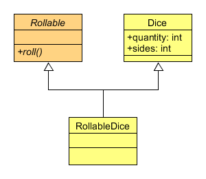

==========
Dice model
==========

While the Dice class represents a dice group, it is the RollableDice the actual
class which will be used by the parser, as it allows generating random values
through the use of the roll() method.

The Rollable abstract class is actually used to extend to add compatibility
between the dice and other classes, and will be used by the parser nodes to
allow rolling any parsed dice notation expression.
