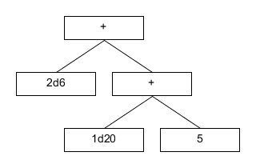
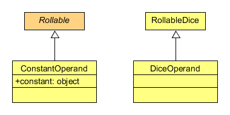
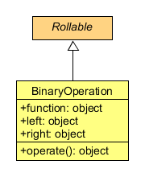

==============
Notation model
==============

The dice notation grammar is meant to allow working with dice notation
expressions, which will be transformed into an equivalent structure by using
a custom model.

As the model user is very simple the structure generated will be a simple
tree, where nodes are connected by the use of operations.

For example, the expression “2d6+1d20+5” would become something like this:

-------
Operand
-------

The leaf nodes are composed by operands, these just store a value which will be
used by other components of the model.

They are all instances of the Rollable abstract class, and currently only two
exist, the ConstantOperand and the DiceOperand.

---------
Operation
---------

A single operation, the BinaryOperation, is given. This just takes the left and
right sided arguments of the operation and passes them to a function.

As the function is, just like the arguments, a field in the class it is
possible to set the function dynamically, supporting this way functional
programming.
