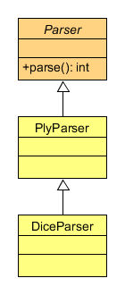

======
Parser
======

The DiceParser is capable of transforming dice notation expressions into the
dice notation model.

It is based on Ply, and contains all the rules defined in itself.

The classes it extends over are just meant to allow extensions, not to be used
by themselves.
